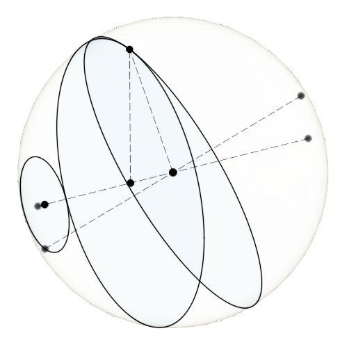
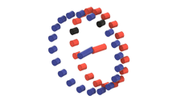
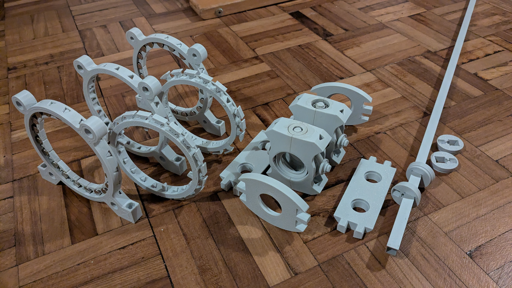

# Spherebox 
### Gear-up for a new concept in mechanical power transmission for renewable energy
#### *Note: This page as it stands represents an MVP for sharing - significant upgrades are planned!*

Spherebox is the working title of a mechanism to efficiently gear-up (or down) rotary motion at ratios of 20:1 or more in a single stage, using spherical geometry and magnets.

I believe it is "novel" in the sense of an invention, but I want to "open-source it" and share it with the world rather than go through the patent process.  Partly, because if it turns out to be genuinely useful, I don't think it should be locked behind a patent.  And, if having it "community owned" will help populaise it, so much the better

Potential Benefits:
* No sliding contact - less friction, less wear --> Less maintainance **+ less power loss?**
* "Soft" backlash, from magnetic force transmission:
  * No risk of impact-loading gear teeth if the load direction changes -->  Less maintainance
  * Lower dynamic loads --> Less structural overhead
* "Overload protection" - the magnetic force transmission will act as a resetable mechanical fuse --> less structural overhead

Potential Risks:
* Oscillating motion-
  * Fatigue risk?
  * Limited output RPM?

The mechanism is targetted at renewable energy applications, which need efficient harnessing of low speed, high torque input, particularly where maintainance is a significant overhead:
* Wind energy
* Small Hydroelectric (e.g. Archimedes screw, water wheel)
* Gravitational energy storage

The "soft backlash" feature could also be beneficial for systems with frequent changes in loading direction
* Flywheel energy storage (enabling a low RPM large diameter rotor?)
* Wave energy

### The Basic Principle

The above animation is an accessible rung on the ladder towards the full design.  Here we have two rings of cylindrical magnets, orientated with the poles opposing each other.  Essentially, they act as bevel gears.  If one were to rotate independently of the other, they would reach a high potential energy state where multiple opposing magnets align perfectly.  That potential energy can be released by the driven side rotating, so it does.

The red magnet ring rotates around the red axle, and the blue magnet ring rotates around the blue axle.  The blue axle is angled slightly to the red axle, which allows the magnets to approach and retreat from one another in a well aligned way. There are 20 magnets on the blue ring, and 19 on the red, so for every complete rotation of one ring, the other is one step further round - there are black magnets on each ring to help illustrate this.  The ratio is therefore 19:20.

In this, the red magnet ring is stationary and the *axle* rotates - essentially this configuration is the result of "subtracting" the rotation of the red ring from whole system, like balancing an equation.

In the first animation, the "stepping round" of the black magnets can be thought of as happening each time they come back to the "contact point", ie with each revolution.  Now, the "contact point" moves with the axle, so each rovolution of the axle, the blue ring is rotated by 1/20 of a revolution vs where it was - the ratio is 1:20.  

Or to put it another way: 19/20 - 1 = 19/20 - 20/20 = -1/20

20:1 is a *much* more interesting ratio for potential applications.

Note 20:1 isn't the only ratio that works, but smaller ratios are less interesting, and the angle between the magnet rings' axes gets larger.  Higher ratios are certainly possible, but necessitates a physically larger mechanism, and potentially new engineering challenges. The main reason why I settled on 20:1, is that means I could order a batch of 100 magnets for the prototype...

### The Prototype

It's all very well having an idea for some new geometry, and having some expectations about how it might perform.  It's another thing to go through the engineering required to turn it into something buildable, and solve the problems that emerge along the way - most people will take a working prototype much more seriously.

The above animation, is the largely finalised design for the physical prototype, engineered to be largely 3D printed.  There are two mobile (blue equivalent) magnet rings, opposed for dynamic balance.  Each has a static magnet ring to both sides, with a central one shared, for 3 in total.  Coupling the motion of the mobile magnet rings to the 'carrier', is through universal joints - the magnet spacing is modulated to compensate for this not being true 'constant velocity'

Large amounts of this have already been 3D printed, and partially assembled:

### Contact

Click into [this form](https://docs.google.com/forms/d/e/1FAIpQLSe6MrAKegJnGeBFqWHNpLd3BzMV_V_qUuoPYknB6AqLB_xypg/viewform?usp=header) if you'd like to get in touch to discuss in more detail, or simply to be notified of updates.